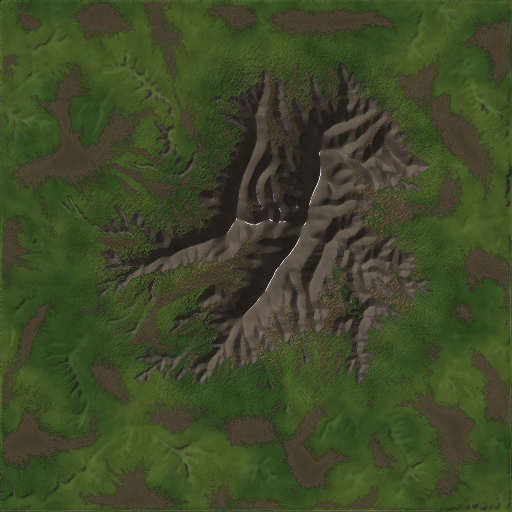

# ▲ Frontier — SDF Terrain Studio

A **signed-distance-field terrain generator** with a professional studio UI:
synthesize a 100×100&nbsp;m multifractal mountain peak, carve it with
**SDF-aware hydraulic erosion** (droplet + thermal + anti-alias relaxation),
derive a Gaea-style **SATMAP stack** (flow, sediment, wear, deposition,
pointiness, peak, concavity, wetness, AO…), and texture the terrain from those
masks. Every step is **voxel-matched**: requested detail, brush sizes and cut
depths are continuously validated against the grid resolution so nothing is
carved that the SDF cannot represent.



- ⛰ **Mountain synthesis** — radial gradient massif mask × domain-warped
  ridged multifractal on seeded gradient (Perlin) noise, plus flank valleys,
  crevices and rolling plains. Octaves auto-clamp to the grid Nyquist limit.
- 🌊 **SDF hydraulic erosion** — particle droplets advected on the true SDF
  surface gradient, with world-space Gaussian splat brushes (≥ 1.5 voxels), a
  CFL-style per-step carve limiter, voxel-aware talus, and sub-voxel-spike
  relaxation. Not mesh erosion: no vertex pushing, no terracing, no pitting.
- ◈ **Voxel / cut matching panel** — live diagnostics: voxel size, brush
  footprint in voxels, deepest/mean cut in voxels, sub-voxel waste %, CFL
  clamp rate, effective octaves. Warns before *and* after the run.
- 🛰 **SATMAPs** — height, slope, aspect, flow (discharge), sediment flux,
  wear, deposition, pointiness, concavity, peak, cavity/AO (horizon-based),
  wetness, curvature.
- 🎨 **SATMAP texturing** — Gaea-style material stack (bedrock, cliff, scree,
  sediment wash, grass/meadow, snow, wet darkening) with fractal breakup.
  4 palettes: alpine, desert, volcanic, arctic.
- 🖥 **Studio UI** — Three.js viewport (textured/shaded/height/slope/flow/…,
  wireframe, auto-orbit, shadows, height exaggeration), SDF cross-section
  viewer, SATMAP gallery, console, one-click exports (OBJ, 16-bit heightmap,
  albedo, SATMAPs, 128³ SDF volume, metadata).

## Quick start

```bash
pip install -r requirements.txt   # numpy, numba, fastapi, uvicorn, pillow, scipy
python3 app.py                    # → http://localhost:8000
```

Pick the **Alpine Peak** preset and hit **▶ Generate Terrain**. A 512² tile
(0.196&nbsp;m voxels) with 350k droplets erodes in ~5–10&nbsp;s on a laptop
(Numba-accelerated; pure-NumPy fallback works without Numba).

Headless / batch mode:

```bash
python3 cli.py --preset sharp_ridge --res 768 --particles 600000 --out exports/
python3 cli.py --preset soft_highlands --skip-erosion --out exports/
```

Run the smoke tests:

```bash
python3 -m pytest tests/ -q
```

## How it works

### 1. The terrain *is* an SDF

The heightfield `h(x, z)` in meters defines an implicit SDF volume:

```
sdf(x, y, z) = (y − h(x, z)) / √(1 + |∇h|²)
```

The denominator corrects raw vertical distance into true closest-point
distance on sloped ground. The UI's **SDF ⬒** button renders a live vertical
cross-section of this field (surface contour + distance bands). You can also
export the full volume (`sdf-volume`, 128³ `.npy`, meters, negative underground).

### 2. Mountain: gradient mask × ridged multifractal

- A **radial gradient cone** (power-shaped, noise-warped footprint, secondary
  lobe) places the massif; it also scales fractal amplitude so detail
  dissolves into the foothills instead of clipping.
- A **domain-warped ridged multifractal** `(offset − |noise|)²` with
  signal-dependent octave weights builds sharp crests and cirque-like bowls.
- Flank-valley carving, crevice deepening and gentle plains fBm finish it.
- Requested octaves are clamped so the finest wavelength stays above
  **2 voxels** — finer octaves are reported, not silently wasted.

### 3. SDF hydraulic erosion (not mesh erosion)

Classic droplet erosion assumes `cell == 1` and pushes height samples around
freely. On an SDF that creates sub-voxel splats, pits and terracing. Frontier
adapts the algorithm to the field:

| Mesh-erosion failure | SDF-erosion fix |
|---|---|
| Brush radius in cells, can be sub-voxel | Brush specified in **meters**, clamped to **≥ 1.5 voxels**, normalized Gaussian splat |
| One droplet can remove meters per step → pits | **CFL limiter**: max carve per droplet-step is a fraction of a voxel; clamp rate is reported |
| Capacity math assumes cell = 1 | All slopes in **world units** (dh_m / step_m); identical behaviour at any resolution |
| Erosion while ascending / below the step drop | Classic anti-pit cap: `carve ≤ downhill drop`, never uphill |
| Thermal erosion in height units | Talus threshold = `tan(angle) × voxel` (voxel-aware) |
| High-freq spikes between samples | **SDF relax passes** damp only curvature above the grid Nyquist |

Droplets additionally accumulate the maps erosion *observes*: discharge
(`flow`), suspended sediment, `wear`, `deposition`, `talus`.

### 4. Voxel / cut matching

Erosion detail must live **at or above the voxel scale** — this panel proves it:

- **Before the run**: brush footprint in voxels, CFL step cap, octave/Nyquist
  advisory (“2 finest octaves carry no representable detail…”).
- **After the run**: deepest + mean cut in meters *and voxels*, % of carved
  cells that moved < 1 voxel (waste), % of carve the CFL limiter absorbed.

Status is `ok` / `warn` / `bad` with plain-language fixes
(“Raise particle count instead of erode speed”, …).

### 5. SATMAPs → texture

`terrain/satmaps.py` computes the mask stack; `terrain/texture.py` blends the
material layers with fractal-broken transitions (no contour rings). Key masks:

`height · slope · aspect · flow · sediment · wear · deposition · pointiness ·
concavity · peak · cavity · ao · wetness · curvature`

## Project layout

```
app.py                 FastAPI backend + job runner + preview/export API
cli.py                 headless batch CLI
terrain/
  noise.py             seeded Perlin gradients, fBm, billow, ridged-MF, domain warp
  sdf.py               SDF definition, grid, brushes, voxel-match diagnostics
  mountain.py          gradient-masked multifractal peak synthesis
  erosion.py           SDF droplet + thermal + relax erosion (Numba cores)
  satmaps.py           Gaea-style data-map stack (flow/sediment/peak/…)
  texture.py           SATMAP-driven material stack + palettes
  exporters.py         PNG previews, OBJ, heightmap, SDF slice/volume
  pipeline.py          presets + full-pipeline orchestration
frontend/              studio UI (Three.js viewport, panels, gallery)
tests/                 engine smoke tests
exports/               pipeline/CLI outputs (git-ignored)
examples/              reference renders
```

## API sketch

| Endpoint | Purpose |
|---|---|
| `POST /api/pipeline` | start run → `{job_id}` (poll `GET /api/jobs/{id}`) |
| `POST /api/retexture` | instant albedo re-render from current SATMAPs |
| `POST /api/voxel-check` | pre-run voxel/detail advisory |
| `GET /api/preview/{map}?size=` | PNG of any SATMAP / albedo / shaded / normals / sdf-slice |
| `GET /api/mesh?res=` | downsampled heights (base64 f32) for the 3D view |
| `GET /api/export/{obj,heightmap,albedo,satmaps,sdf-volume,meta}` | file exports |

## Tuning guide (100 m tile @ 512², voxel ≈ 0.196 m)

- **More dramatic gullies**: droplets 500k+, lifetime 56, erode speed 0.35.
- **Softer, older mountain**: thermal passes 20+, talus 32°, relax 3.
- **Finer detail**: res 768/1024 (voxel 0.13/0.10 m) — keep brush at 2–4 voxels
  (0.3–0.5 m) and raise droplets; watch the voxel panel.
- **Volume check**: a good run moves a few thousand m³ with net ≈ small vs
  eroded (mass conserved except tile-edge outflow).

## License

MIT — do what you want with your mountains.
