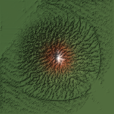

# Frontier — SDF Terrain Lab

A signed-distance-field (SDF) terrain workstation that runs entirely in the browser:
gradient-multifractal mountain synthesis → **true 3D SDF voxelisation** → **SDF-native
particle hydraulic erosion** → **D8 drainage / stream-power incision** → **Gaea-style
SAT maps** → sphere-traced real-time rendering — with a live audit that proves the
**voxel resolution and the amount cut into the terrain stay matched**.

Default test domain: **100 × 64 × 100 m**, isotropic voxels (≈520 mm at the balanced
192³-class grid), up to 288²-class grids (~24 M cells) in the browser, no native code.



## Run it

```bash
node server.js          # → http://localhost:8080
```

No build step, no npm dependencies. The simulation runs in a Web Worker; the renderer
is WebGL2 sphere tracing of the 3D distance-field texture.

## Pipeline

| Stage | Module | What happens |
|---|---|---|
| 1 · Multifractal synthesis | `src/core/noise.js`, `terrain.js` | Seeded Perlin gradient noise. Ridged / hybrid multifractal with domain warp, super-elliptical peak mask and a directional tilt gradient build the mountain heightfield. Octaves are **auto-clamped so the smallest wavelength ≥ 3 voxels** — the grid can actually represent every feature the noise asks for. |
| 2 · SDF voxelisation | `src/core/sdf.js` | The heightfield is seeded into a 3D float grid and redistanced with a **narrow-band fast-sweeping Godunov eikonal solver** (anisotropic-capable, verified |∇d| ≈ 1 at the surface). Sign convention: negative inside rock. |
| 3 · Particle hydraulics | `src/core/erosion.js` | **Mesh-free, heightmap-free erosion designed for SDFs:** droplets flow *on the implicit isosurface* — gravity is projected onto the tangent plane, and each step ends with a Newton re-projection `P ← P − SDF(P)·∇SDF(P)` onto the *evolving* zero level set. Cuts are volumetric smooth-cubic stamps written directly into the distance field (`sdf += cut·K` removes rock, `sdf -= dep·K` deposits). CFL velocity clamping, waterfall bypass (plunges transport but don't cut), pit-filling, evaporation. |
| 4 · Mass wasting | `src/core/erosion.js` | Angle-of-repose talus slumping on column heights extracted from the field, baked back as bounded column deltas. |
| 5 · Fluvial incision | `src/core/flow.js` | Priority-flood depression filling → D8 receivers (with meander jitter) → flow accumulation → stream-power incision `E = K·A^m·S^n` with lateral V-valley term. This produces the *dendritic drainage network*; individual droplets alone can never do that. Carved into the SDF as bounded per-round deltas. |
| 6 · Redistancing | `src/core/sdf.js` | Fast-sweep re-solve after every erosion batch so the volume stays a true signed **distance** field — this is what keeps sphere tracing, soft shadows and AO valid. |
| 7 · SAT maps | `src/core/satmaps.js` | Gaea-style surface attribute maps: **flow, sediment, wear, peaks, pointiness, slope, height, wetness** — packed into 2 × RGBA8 textures that drive the material (rock exposure, grass, talus, sediment fans, channel wetness, snow). |
| 8 · Render | `src/client/gl.js` | Sphere-traced ray marching of the `R32F` 3D texture with adaptive stepping, iq-style soft shadows, 5-tap AO, hypsometric + SAT-driven triplanar material, distance fog, and an **SDF inspector** (clip plane + distance contours + voxel grid visualisation). |

## The resolution ↔ cut contract

Every cut is accounted for. The stamp itself enforces, per affected column:

- per-step carve ≤ **0.35 voxel**,
- per-column integrated cut ≤ **(2.5 + 6·depth) voxels** (a hard bedrock floor for
  particles), stream-power incision adds a further bounded ~1.4 voxels per round,
- the audit re-measures the *actual* heightfield change from extracted column
  heights (`heights0` vs final) and reports mean / channel-mean / max cut **in
  metres and in voxels**, side-by-side with the voxel size and the budget.

The right-hand panel shows this live:

```
max cut 4.50 m  (budget 5.21 m)      → ✅ within budget
channel depth 0.61 m · 1.17 vox      → ✅ resolvable detail
CUT ↔ RESOLUTION MATCHED
```

because a channel incised less than ~⅓ voxel is invisible at the current grid, and a
cut deeper than the budget means the simulation is punching through features the
resolution can't hold — both fail the contract and are flagged in the UI.

## Exports & session QoL

**Export bundle** downloads a ZIP (encoded in-browser, zero dependencies):

- `heightmap_16bit.png` — 16-bit grayscale
- `satmaps/*.png` — all 8 SAT maps
- `sdf/volume_u16.raw` + `sdf/header.json` — the quantised SDF volume
- `params.json`, `AUDIT.md` — full parameter set + measured audit table

Plus: **Save PNG** viewport capture, **keyboard shortcuts** (`R` regenerate,
`I` inspector, `T` flow trails, `S` save PNG), and parameter persistence via
`localStorage` (shareable `?seed=<n>` URL parameter).

## Node harnesses

```bash
node tools/sim-test.mjs [res] [droplets]   # headless pipeline + diagnostic PNGs + |∇d| audit
node tools/tune.mjs                        # base-vs-eroded shaded relief + flow map
node tools/worker-e2e.mjs [res] [drops]    # runs the *actual browser worker* end-to-end, validates the ZIP
node tools/seed-sweep.mjs                  # contract compliance across seeds
```

Validated matrix (all PASS — no phantom bores/towers, max cut within budget):

| Grid | Voxel | Channels | Max cut vs budget | Time |
|---|---|---|---|---|
| 128² | 781 mm | 0.9 vox | 4.0–5.0 / 7.9 m (5 seeds) | ~15 s |
| 192² | 521 mm | 0.91 vox | 3.24 / 5.21 m | ~50 s |
| 288² | 347 mm | 0.88 vox | 2.18 / 3.13 m | ~147 s |

## Design notes

- **Why particles on the isosurface rather than a heightmap loop?** The user-visible
  surface of an SDF after erosion is still an implicit function — droplets that ride
  the isosurface via tangent gravity + Newton reprojection are the direct analogue of
  heightmap droplets, but they work on overhangs, tunnel roofs and cliff faces, and
  their cuts are volumetric, so the field stays consistent in 3D.
- **Why also D8/stream-power?** Independent droplets produce realistic hillslope
  transport but statistically noisy, non-dendritic "flow" maps. Real drainage
  networks need global downstream routing (priority-flood + D8 accumulation). The
  combination — particles for hillslopes, stream-power for channels — is what gives
  the dissected look in the preview above.
- Everything is deterministic given a seed (mulberry32 PRNG, fixed batch order), so
  the audit numbers are reproducible.
