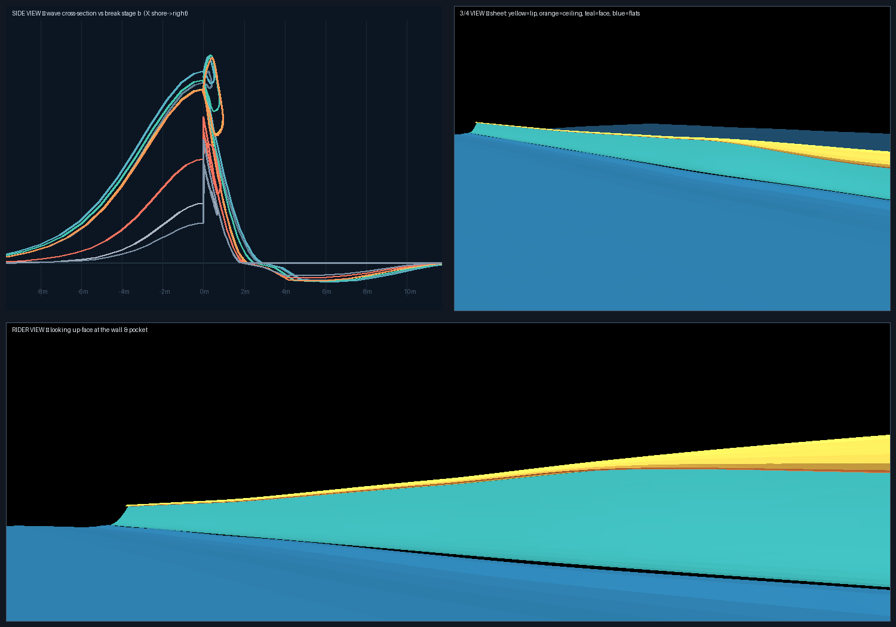

# SET LINE

**Surf a real, breaking wave in the browser.** A parametric, physically
peeling surf wave — steep wall, pitching lip, hollow tube, churning whitewash —
rendered with closed-form math and zero assets. No dependencies, no textures,
no FFT. The wave is *cheap* (one draw call of analytic vertex displacement)
and aims to be as *realistic* as that budget allows.



## Run it

```bash
npm start            # python3 -m http.server 8000 --bind 0.0.0.0
# open http://localhost:8000
```

Any static file server works (`npx serve`, nginx, …). Needs a browser with
**WebGL2** (all current desktop/mobile browsers).

## How to surf

1. **PRESS SPACE** on the title — a set wave swings in and you start paddling.
2. **Hold SPACE** to paddle; when the face lifts you, you pop up (*later =
   steeper drop = bonus*).
3. **`A`/`D`** carve. Hold height on the face — it's a moving half-pipe, so
   you trade speed for height and back. **SPACE** pumps, **S** stalls.
4. Race the peel down the line (**watch the foam ball in the mirror of your
   mind**), **SHIFT** to tuck when the lip throws over you.
5. **K** kicks out clean before the closeout ends it for you.
6. **F** drops you into a free-fly camera to inspect the wave (like an editor
   viewport): hold **RMB** (or **LMB**) and drag to look, **WASD** to fly,
   **Q**/**E** down/up, **SHIFT** fast, mouse **wheel** for speed. **F** again
   returns to the action — from exactly where you left it.

Score = distance + maneuvers (combo ×5 max) + barrel time + airs + style.
Wipeouts bank only half the ride.

## The wave, in one paragraph

Every sample of water is an analytic function of `(z, t)`. A peel point
`z_b(t)` races along the crest; the break stage `b = (z_b − z)/(v_peel·T)`
tells each section how far through its life it is — clean wall → pitching lip
→ foam pile → soup. The crest cross-section is an 8-point control polyline
that *morphs* between a rounded leaning rim (unbroken), a thrown lip with a
tube ceiling (hollow — genuine overhang geometry), and a lumpy foam mound
(collapsed). The surfboard rides the same functions on the CPU. Details:
[`DESIGN.md`](DESIGN.md) and the comments in
[`src/waveshape.js`](src/waveshape.js) (the heart of the project).

## Project layout

```
index.html, style.css     shell + HUD
src/waveshape.js          THE WAVE — GLSL + JS ports of one shape model
src/water.js              sheet mesh + water shader (fresnel/SSS/foam)
src/sky.js                analytic sky (shared for reflections)
src/beach.js              sand & dunes
src/physics.js            surfboard dynamics on the moving heightfield
src/surfer.js             procedural board + rider
src/spray.js              lip spray / rail spray / splash particles
src/camera.js             chase, barrel, attract + free-fly (WASD) cameras
src/game.js               flow, catch mechanic, scoring
src/main.js               loop & glue
tools/dump_profile.mjs    dumps wave samples → JSON (preview pipeline)
tools/render_preview.py   offline shape previews (docs/wave_preview.png)
tools/smoke.mjs           headless bot rides (physics/game regression)
tools/validate_shaders.mjs glslangValidator over every shader
```

## Dev tools

```bash
npm test               # headless bot rides + shader validation
npm run preview:wave   # regenerate docs/wave_preview.png (needs numpy, pillow)
```

`tools/smoke.mjs` simulates bot surfers through the full game loop and asserts
rides complete with sane scores — useful when retuning wave/physics constants.

## Tuning knobs

Everything interesting lives at the top of `src/waveshape.js`
(`makeConditions`) — face height, phase speed, peel speed, curl radius, wind,
sun — plus the three fold keyframes (`KEY_WALL`, `KEY_HOLLOW`, `KEY_PILE`) that
define how the crest looks at each break stage. Physics feel is in
`src/physics.js` (gravity, drag, pump, pocket tow).
