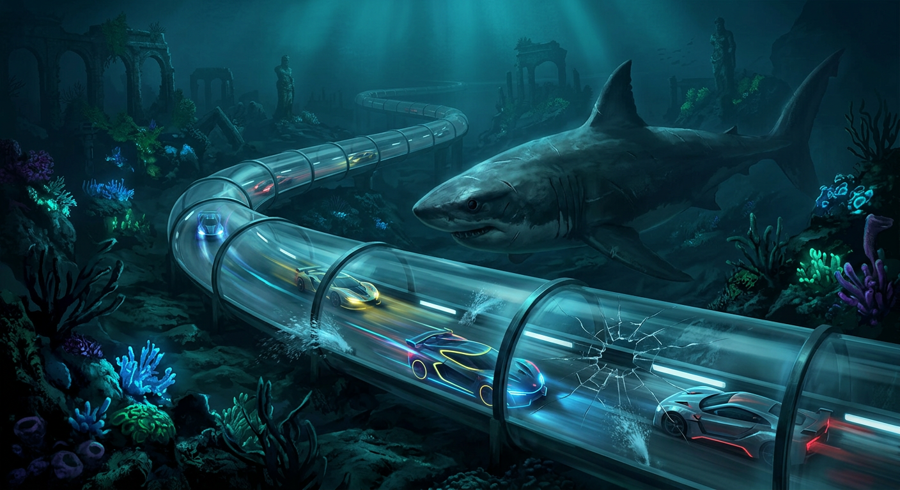
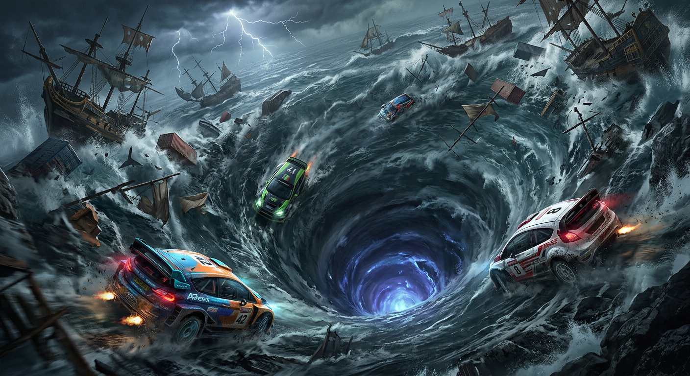
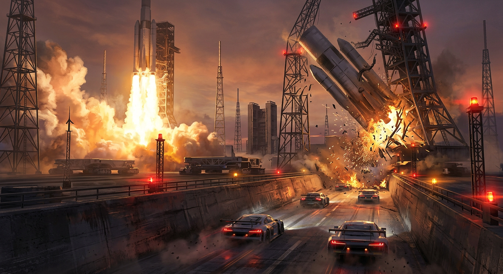
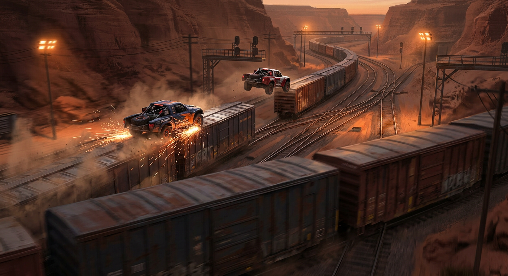
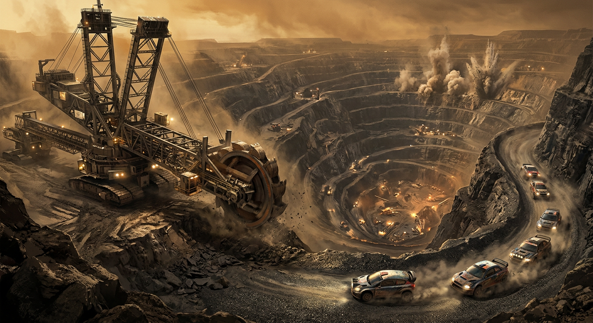

# FRONTIER — LOCKED ROSTER
*The five launch worlds. User-curated, everything else cut. Strictly racing. Ready Player One
DNA: the world is the weapon, hazards are colossal, no weapons — you bait the world into hitting
your rivals.*

---

## The Game

**SHIFTGAUNTLET** — a Grand Gauntlet is a point-to-point race chaining the five worlds together
via **World-Shifts** (colossal portal rings that the road assembles mid-race; physics change
per world; the shift gate collapses on the tail of the field). 24 cars start a full-race draw;
each world shaves the field; the last world crowns a handful of survivors.

**The five rules of the roster:**
1. **Every world has a Gatekeeper** — one apex mechanism whose only job is destroying cars.
   It is learnable, telegraphed, and baitable onto rivals.
2. **Omens, not HUD warnings.** The world tells you everything if you pay attention: sounds shift,
   lights dim, birds scatter. Attention is the meta-skill.
3. **Total wipe = DNF.** Get destroyed, you zero out. RPO stakes.
4. **Escalation.** The longer the race runs / the deeper the lap, the meaner the world gets.
5. **Speed is armor.** Lingering is what most Gatekeepers eat.

---

## 🦈 1. THE ABYSSAL EXPRESS — drowned city / sea-tube sprint

Glass-tube raceways threading the ocean floor through the ruins of a sunken city — kelp-forests
swaying over drowned plazas, sea vegetation glowing against the tube, loop-the-loops winding
through the old transit spine.

- Submerged loops and helix stretches through the ruins.
- Pressure gates blast open jets of seawater; flood events submerge the interior — wheels become
  hydrofoils, grip dies, slides get heroic.
- Leak-jets from spider-cracked glass can be ridden as improvised boost. Brave or stupid, same thing.
- Kelp tangle chokes snag cars that run wide.
- **Gatekeeper: THE FERRYMAN'S TOLL.** A megalodon that hunts engine noise. Every car carries a
  hidden aggro meter fed by revving, pack density, and horn-baits. Peak your meter and it breaches
  the tube at YOUR sector — flood sequence, and a very brief swallow window. Bait play: tailgate a
  rival, redline in their wake, lift off, and let the tube take them. Loud = fast. Loud = food.
- **Escalation:** trench lights die; bioluminescence and angler-lures blink in the dark; the
  Ferryman brings a second shadow.
- **The RPO obstacle:** Ferryman breach at the reef-overpass chokepoint — the classic "nobody has
  made the jump without paying the toll" moment.

---

## 🌀 2. THE MAELSTROM CUP — inside the whirlpool

A ceremonial race held inside the ocean's largest whirlpool: the track bolted to the funnel's
inner wall, spiraling at rude banking angles down toward a glowing throat. You race on the inside
of a drowning.

- Banking steepens every sector of the descent; the rim far above spits lightning into the spray.
- Debris carousel: wrecked galleons and cargo hulks orbit the funnel on their own laps — you meet
  the same shipwreck twice, from different angles.
- Foam-slicks and spout-geysers jet across lanes on the vortex's breathing rhythm.
- **Gatekeeper: THE THROAT.** The vortex inhales: dead-stop pulses where the funnel tightens and
  the outer lanes sink a level. Cars caught high when the pulse lands slide down the wall into the
  drink; the lowest lanes just get wet. Omen: the spiral's roar drops half an octave. Sin punished:
  greedy high lines on the breath cycle.
- **Escalation:** the Throat inhales deeper and more often; debris orbits decay closer to the lanes;
  the final sector races a drumbeat of inhales.
- **The RPO obstacle:** the leap between two rotating debris ships during an inhale pulse — the
  gap that closes off the low line for anyone arriving late.

---

## 🚀 3. IGNITION ALLEY — the launch range

A working spaceport the size of a nation, and today is launch day — plural. The circuit runs flame
trenches, pad crawlers, and gantry canyons while the heaviest machines humanity builds try very
hard not to murder you. They mostly fail.

- Launch corridors flood with exhaust-fire on hard countdowns; pad sectors bathe in shockwaves
  that shove whole packs sideways.
- Returning boosters come home drunk — trauma-guided meteors threading the gantries, and they do
  not check traffic.
- Cryo-fog banks off fueling towers; building-sized VAB crawlers cross the circuit like slow
  continents.
- **Gatekeeper: THE SCHEDULE.** Launches and landings run a public timetable — T-minus clocks are
  painted ON the road. Be in a marked trench at T-0 and physics deletes you. Bait play: feint into
  a trench corridor so the car behind follows you in, then bail through the runoff gate on the
  omen-siren.
- **Escalation:** launch cadence doubles; the finale is raced during a *window stack* — three
  events at once.
- **The RPO obstacle:** the main flame trench during terminal count — everyone's Kong-at-the-jump
  moment: make the trench crossing before ignition, or don't make anything ever again.

---

## 🚂 4. TERMINUS — the switchyard

A desert canyon of rails where the trains are the traffic, the terrain, and — if you're good —
the track. Roofs, couplings, flatbeds: the whole yard moves at 140 km/h and doesn't care which
direction you're pointed.

- Train-hopping is the core line: grind a freight roof, gap-jump to a parallel express, draft the
  slipstream between two passing walls of steel.
- The network is alive: switches clack, trains diverge, a lane you were driving simply leaves.
- Freight crossings: 900-car landships rolling through intersections like slow iron curtains.
- **Gatekeeper: THE SWITCHMASTER.** The yard's ancient routing intelligence punishes static traffic:
  linger too long on any single train and it quietly re-routes *you* — onto a spur, toward a buffer,
  into the guillotine geometry of a closing junction. Omen: the signal box singing your train's
  new number. Sin punished: sitting still on something that moves for a living.
- **Escalation:** yard tempo rises; by the end it's routing trains *at* the pack.
- **The RPO obstacle:** the Dead Man's Junction triple-cross — the coin-flip flat crossing where
  the fast line exists only if you read which landship arrives second.

---

## ⛏️ 5. THE SPIRAL — the kilometre-deep descent

The largest hole ever dug: an open-pit mine whose terraces spiral from horizon to magma-glow. The
race is one continuous descent — no laps, just lapses — down a staircase built for machines the
size of towns.

- Terrace-hopping: drop-shafts and ore-chutes as vertical shortcuts between spiral levels.
- Blast plumes erupt on scheduled faces; debris rain rolls downhill — everything you knock loose
  this sector meets you again lower down.
- Haul-truck traffic: 400-ton beasts that own their lane and both lanes adjacent.
- **Gatekeeper: BEHEMOTH.** The largest bucket-wheel excavator ever built, eating terraces one
  revolution at a time. Its toothed wheel is both the deadliest object on the track and the
  bravest shortcut — through the spokes, if your nerve holds. BEHEMOTH doesn't know you're racing.
  BEHEMOTH knows only *dig*.
- **Escalation:** blast schedule compresses; the lower terraces glow hotter; BEHEMOTH finds the
  good rock — which is where the track is.
- **The RPO obstacle:** the shuttle-window through BEHEMOTH's own wheel — the spokes line up for
  one car-width every few revolutions. The gate everyone spectates and nobody volunteers for.

---

## Suggested gauntlet flow (default draw order)

1. **The Spiral** — opener: 24 cars, wide, legible, loud. Establishes escalation + Gatekeeper rules.
2. **Terminus** — metal traffic chaos; trims the pack to the brave.
3. **Ignition Alley** — timetable discipline under maximum spectacle.
4. **The Abyssal Express** — claustrophobic noise-management knife-fight.
5. **The Maelstrom Cup** — finale: a descending spiral that deletes the indecisive until three
   cars race the cup itself.

*Roster status: LOCKED. Five worlds. No more, until one of these earns company.*
